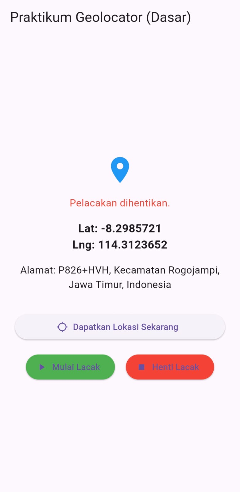
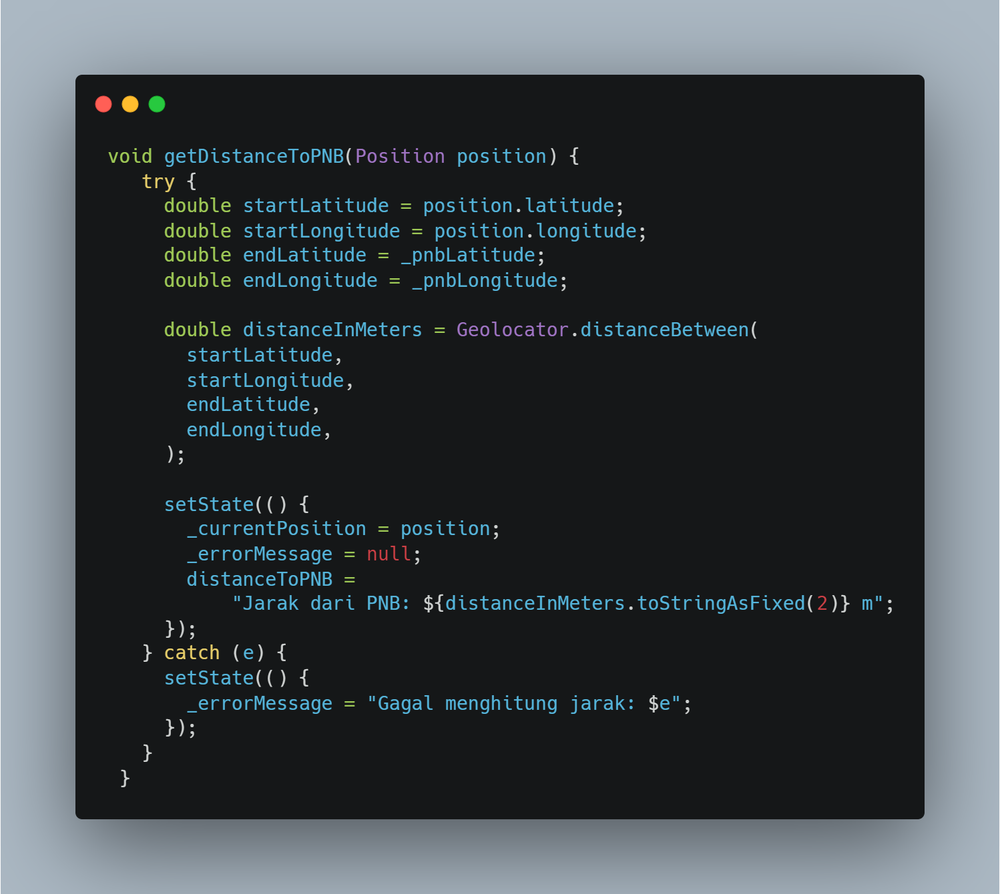

# project_geo

# Tugas 1: Geocoding (Alamat dari Koordinat)

Saat ini kita hanya menampilkan Lat/Lng. Buatlah agar aplikasi menampilkan alamat (nama jalan, kota, dll) dari koordinat yang didapat. Petunjuk:
1. Anda sudah menambahkan paket geocoding di pubspec.yaml.
2. Import paketnya: import ’package:geocoding/geocoding.dart’;
3. Buat variabel String? currentAddress; di MyHomePageState.
4. Buat fungsi baru getAddressFromLatLng(Position position).
5. Panggil fungsi getAddressFromLatLng( currentPosition!) di dalam getLocation dan startTracking (di dalam .listen()) setelah setState untuk currentPosition.
6. Tampilkan currentAddress di UI Anda, di bawah Lat/Lng.

## Penjelasan Fungsi getAddressFromLatLng
1. Fungsi bertipe void yang berarti tidak mengembalikan nilai apapun.
2. Menerima 1 parameter bertipe Position dengan nama position, menampung nilai dari latitude dan longitude dalam Position.
3. Didalamnya ada try catch untuk mengatur error, saat kode mengalami masalah apapun maka akan menjalankan kode didalam catch yakni memberi nilai pada variabel _errorMessage dengan setState.
4. Didalam try, variabel placemarks bertipe list yang menampung nilai bertipe Placemark yakni tipe data yang menampung informasi dari latitude dan longitude termasuk alamat.
5. variabel placemarks memanggil fungsi await placemarkFromCoordinates(latitude, longitude).
6. Dilakukan pengecekan apakah placemarks apakah ada isinya, jika tidak kosong maka ambil index ke-0 dari placemarks, masukkan ke dalam variabel place dengan tipe Placemark.
7. Kemudia perbarui _currentAddress dengan setState, masukkan kombinasi dari place.street (nama jalan), place.locality, place administrativeArea, dan place.country (negara)

Berikut kodenya:

## Screenshoot Hasil

# Tugas 2: Jarak Real-time ke Titik Tetap
Manfaatkan fungsi Geolocator.distanceBetween dari Langkah 4.
1. Buat variabel String? distanceToPNB; di MyHomePageState.
2. Di dalam startTracking (di dalam .listen()), panggil fungsi untuk menghitung
jarak:
3. Simpan hasilnya di distanceToPNB menggunakan setState.
4. Tampilkan distanceToPNB di UI agar jaraknya ter-update secara real-time saat
Anda bergerak

## Penjelasan Fungsi getDistanceToPNB
1. fungsi getDistanceToPNB memiliki tipe void yang artinya tidak mengembalikan nilai apapun,
2. fungsi ini juga menerima 1 parameter bertipe Position
3. didalamnya ada try catch, saat terjadi masalah/error maka akan langsung diarahkan ke catch, didalamnya ada setState yang memperbarui _errorMessage dengan nilai pesan error.
4. didalam try ada kode untuk mendapatkan jarak posisi saat ini dengan jarak ke PNB
5. ada 4 variabel yakni startLatitude dan startLongitude diambil dari parameter position sedangkan endLatitude dan endLongitude diambil dari variabel _pnbLatitude dan _pnbLongitude diatas.
6. untuk mengetahui jarak dalam meter dapat dilakukan dengan menggunakan fungsi bawaan geolocator yakni distanceBetween. Didalamnya ada 4 parameter, urutannya harus sesuai dimulai dari latitude awal, longitude awal, latitude akhir, dan longitude akhir.
7. kemudian setState untuk memperbarui nilai pada variabel-variabel yang bersangkutan, _currentPosition diperbarui menyesuaikan position, _errorMessage dinullkan supaya tidak ada pesan error, dan distanceToPNB dimasukkan nilai string berisi informasi jarak dari PNB, karena distanceToPNB dalam bentuk double jadi diubah ke dalam string dengan fungsi bawaan yakni toStringAsFixed dengan nilai 2 yang mana artinya nilai yang tampil akan menunjukkan 2 angka dibelakang koma.

Berikut kodenya: 

## Screenshoot Hasil
